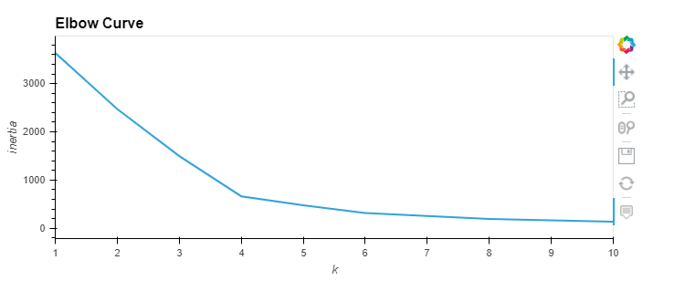
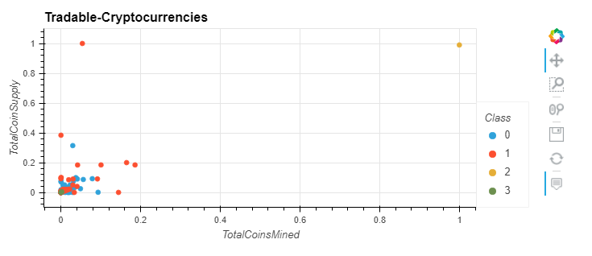

# Overview of Project:

Accountability Accounting, a prominent investment bank, is interested in offering a new cryptocurrency investment portfolio for its customers. 
However, the universe of cryptocurrencies is vast and complicated. We have been tasked to create a report that includes what cryptocurrencies are on the trading market and how they could be grouped to create a classification system for this new investment.
We used to achieve this project clustering algorithm from un unsupervised machine learning model, and they showcase visualizations to share our finding with the stakeholders of Accountability Accounting.

# Results:

- In a first part we preprocess our dataset in order to be able to perform a PCA algorithm (Principal Component Analysis).
- Then we apply PCA to reduce dimensions who have been preprocessed to three principal components.
- In a third part, we create an elbow curve.

   
 This part allow us to predict the good amount of clusters for our analysis (4 in this case), then we were able to run the K-means algorithm with a K-number of 4 to make predictions on how to group cryptocurrencies by clusters.
  
- The last part was to make visualizations of our finding. We create scatter plots to visualize the distinct groups that correspond to the three components created previously. This enables us to showcase all the currently tradable cryptocurrencies.

   
This results can help the board of Accountability Accounting offering a new cryptocurrency investment portfolio for its customers.